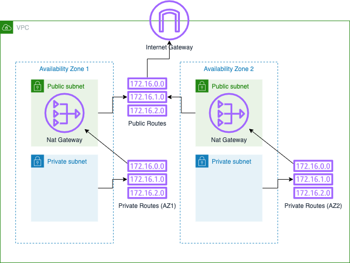

# aws-usach-labs
Repositorio de laboratorios de USACH

# Arquitectura
Crea una red VPC con 2 subnets públicas y 2 subnets privadas en 2 zonas de disponibilidad.
Además, crea 2 natgateways para tener alta disponibilidad en la sálida a internet.

